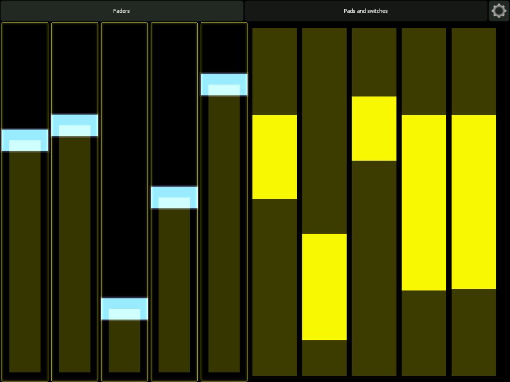
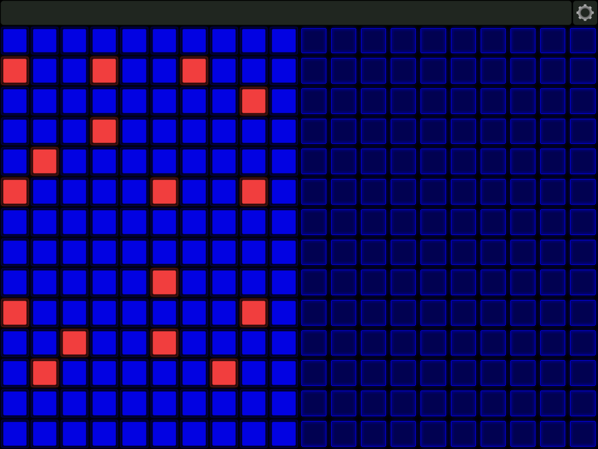

# SCLemurLib

## About 

SCLemurLib contains set of classes and helpfiles, developed using the SuperCollider environment, to build OSC/MIDI UI interfaces in the Lemur (from Liine.net) application.

The main entry point for you is the LemurClient class. By using this class you can add, update and remove widgets on various pages/interface as an extension to your own instruments and programs written using the SuperCollider environment. 

This library depends on: https://github.com/supercollider-quarks/XML

```
Quarks.install("XML");
```

## Current entities and their relationships


## Example code

Override the defaultRemoteIP in the startup.csd
```
LemurConnection.defaultRemoteIP = "192.168.2.11";
``` 

In your code you don't need to provide a remote IP when the default is overridden.
```
LemurClient().connect
```

Resetting lemur is easy once a connection is made.
```
LemurClient().reset
```

Add a bunch of faders to a page with the title Faders
```
(
l.fader("Faders", "fader1");
l.fader("Faders", "fader2", 100);
l.fader("Faders", "fader3", 200);
l.fader("Faders", "fader4", 300);
l.fader("Faders", "fader5", 400);
l.range("Faders", "range1", 500);
l.range("Faders", "range2", 600);
l.range("Faders", "range3", 700);
l.range("Faders", "range4", 800);
l.range("Faders", "range5", 900);
)
```



Add 2 matrices of pads and switches
```
l.switches("Pads and switches", "switches1", 0, 0, 512, 724, 10, 14);
l.pads("Pads and switches", "pads1", 512, 0, 512, 724, 10, 14);
```


Add a bunch of faders in 2 rows (with screenshot)
```
40 do: { |i| l.fader("Sine", i, (i % 20) * 50, 362 * floor(i / 20), 50, 362); };
// Random slider values.
40 do: {|i|  l.lemurConnection.oscNetAddr.sendMsg('/_'++i++'/x', 1.0.rand)};
// Draw a phase shifting sine
p = 0; t = Task({ loop { p = p + 0.1; ((0..40) collect: { |i| l.lemurConnection.oscNetAddr.sendMsg('/_'++i++'/x', sin(i / 40 * 4 * pi + (p)) * 0.5 + 0.5) }); 0.05.wait; } }).play;
t.stop;
```


## Futher development 

Almost 7 years ago I kind of quit music and technology. However this year (2021) I have got more time to fiddle around with this kind of small hobby projects. 

This library was initial part of my caAC-MLib. A while ago I moved the Lemur specific code to this repository. I have reformatted quite some code. Instead of working with string formatting I started use the XML lib to programmatically constructor the DOM models which are formatted into XML before sending to Lemur. All of this is based on defaults stored in a MultiLevelIdentityDictionary. The defaults you can override in the startup.csd file for now in the intermediate LemurClientRequestBodyBuilder. Note that when the Remote UI Toolkit the current defaults functionaliteit will be handled different. 

### Flexibility

More supported widgets and more flexibility of the attributes you can update. Properly this means that every builder method is going to get an assosiative array for extra settings.

### Remote UI Toolkit

The biggest upcoming change is the reformatting the builder methods into a set of widget like classes that functions as a normal UI toolkit like Qt. Only the difference is that all the GUI madness will happen on a remote device. The interface should respond most of the messages like the default SC widgets. By applying polymorphism a more sence of unity and consistency should be achieved. 

A sort example of the programming interface I have in mind: 

LemurClient (which will target 1 remote device and 1 running Lemur instance)
  LPage
  * LSlider
  * LText 
  * LSlider
  * LText
  * LPads 

  LPage 
  * LSlider
  * LSlider
  * LSlider

More planned features that will be more easy to achieve: 
  * Via widget instances properties you can update on the fly the widgets Lemur.
  * Via static methods you can set default values of a specific widget. 
  * The under the hood the widget instance properties are serialized to XML, which the Lemur app can understand, with the help of the LemurRequestBodyBuillder and send via the LemurClient to Lemur. 

### Consistent connections

Stuff like more consistent connection pooling, automatic reconnecting and message queueing is something that is nice to have. A new ConnectonPoolMonitor class is something that I am going to add to provide a GUI to manage the connections. It's now a be bit dodgy but I will also deal with this.

### Misc/Other
Switch to a page/interface when a slider is added.

## Contribute 

I am open to ideas and pull requests :-). If something is weird or not functioning: Please file an issue and I will take a look at it. 

Also good to note: I am NOT a developer of the Lemur application and also do not have any relationship with Liine.net. I am just a dude who hobbies are around from time to time in my spare time using music environemnts SuperCollider and makes weird algorithmic music. 

