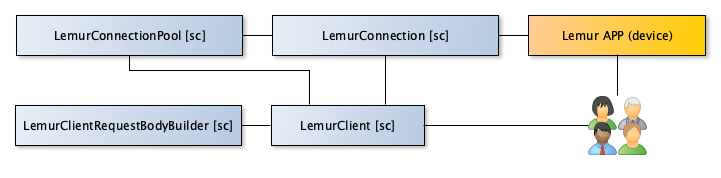
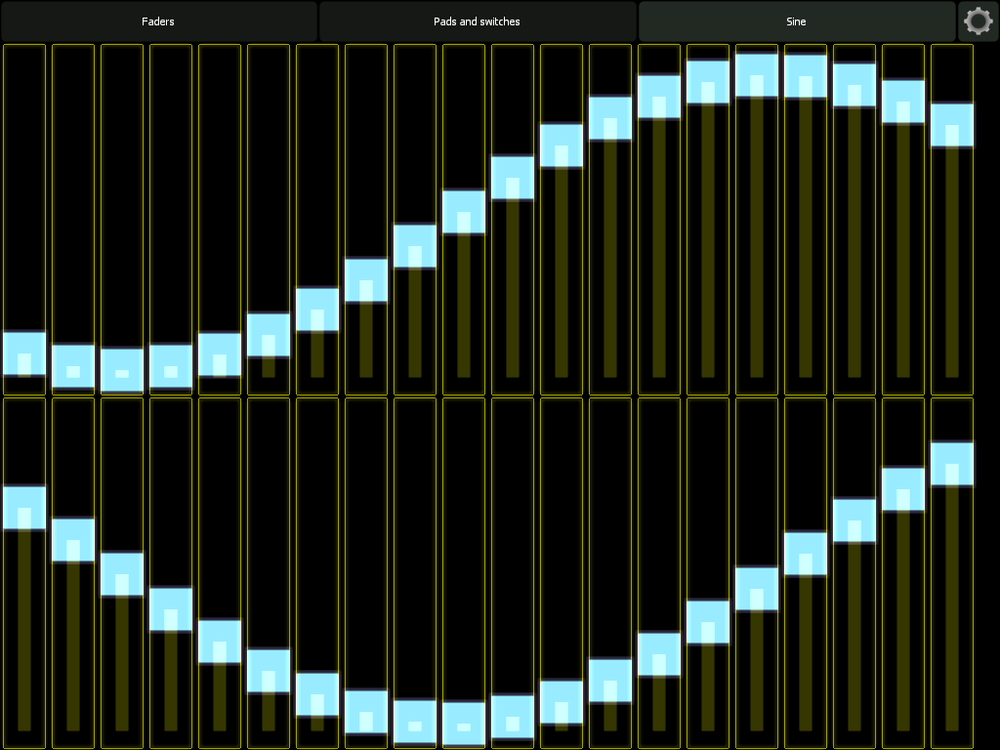
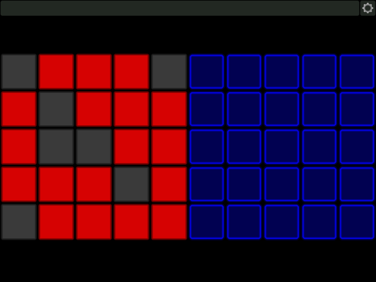
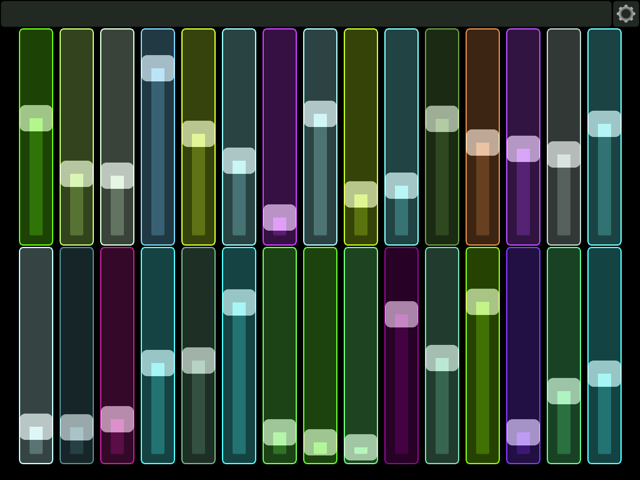

# SCLemurLib

## About 

This library holds set of classes and helpfiles, developed using the SuperCollider environment, to build OSC/MIDI UI interfaces in the Lemur (from Liine.net) application.

The main entry for you is the LemurClient class. By using this class you can add, update and remove widgets on various pages/interface as an extension to your own instruments and programs written using the SuperCollider environment. 

This library depends on: https://github.com/supercollider-quarks/XML

```
Quarks.install("XML");
```

## Current entities and their relationships



## Example code

Override the defaultRemoteIP in the startup.csd
```
LemurConnection.defaultRemoteIP = "192.168.2.11";
``` 

In your code you don't need to provide a remote IP when the default is overridden.
```
LemurClient().connect
```

Resetting lemur is easy once a connection is made.
```
LemurClient().reset
```

Add a bunch of faders to a page with the title Faders
```
(
l.fader("Faders", "fader1");
l.fader("Faders", "fader2", 100);
l.fader("Faders", "fader3", 200);
l.fader("Faders", "fader4", 300);
l.fader("Faders", "fader5", 400);
)
```

### Add a bunch of faders in 2 rows (with screenshot)
```
40 do: { |i| l.fader("Sine", i, (i % 20) * 50, 362 * floor(i / 20), 50, 362); };
// Random slider values.
40 do: {|i|  l.lemurConnection.oscNetAddr.sendMsg('/_'++i++'/x', 1.0.rand)};
// Draw a phase shifting sine
p = 0; t = Task({ loop { p = p + 0.1; ((0..40) collect: { |i| l.lemurConnection.oscNetAddr.sendMsg('/_'++i++'/x', sin(i / 40 * 1 * pi + (p)) * 0.5 + 0.5) }); 0.05.wait; } }).play;
t.stop;
```



## More screenshots 





## Futher development 

Almost 7 years ago I kind of quit music and music technology because of the lack of time. And haven't look at this kind of stuff for a long time. However I got more time now to fiddle around with this kind of nice hobby projects. 

This library was initial part of my caAC-MLib. A while ago I moved the Lemur specific code to this repository. 

The first step was the reformat the code so that the XML request messages are build in a separate object. The XMLs are created based on default values which you can override. The next is to build a OOP remote widget library as the interface to build UIs on the Lemur App.

### Flexibility

More supported widgets and more flexibility of the attributes you can update. Properly this means that every builder method is going to get an assosiative array for extra settings.

### Remote UI Toolkit

The biggest upcoming change is the reformatting the builder methods into a set of widget like classes that functions as a normal UI toolkit like Qt. Only the difference is that all the GUI madness will happen on a remote device. The interface should respond most of the messages like the default SC widgets. By applying polymorphism a more sence of unity and consistency should be achieved. 

A sort example of the programming interface I like to build: 

LemurClient (like a window)
  LPage
  * LSlider
  * LText 
  * LSlider
  * LText
  * LPads 

  LPage 
  * LSlider
  * LSlider
  * LSlider

More planned features that will be more easy to achieve: 
  * With widget instances properties you can update the widgets Lemur.
  * Via static methods you can set default values. 
  * The under the hood the instance properties are serialized to XML with the help of the LemurRequestBodyBuillder and send via the LemurClient. 

### Consistent connections

Stuff like more consistent connection pooling, automatic reconnecting and message queueing is something that is nice to have. A new ConnectonPoolMonitor class is something that I am going to add to provide a GUI to manage the connections.

### Misc/Other
Stuff like automatic switch to a page/interface when a slider is added. 

## Contribute 

I am open to ideas and pull requests :-). If something is weird or not functioning: Please file an issue and I will take a look at it. 

Also good to note: I am not a developer of the Lemur application or part of Liine.net. I am just a guy who hobbies are around from time to time in my spare time using music environemnts SuperCollider and makes algorithmic music. 

